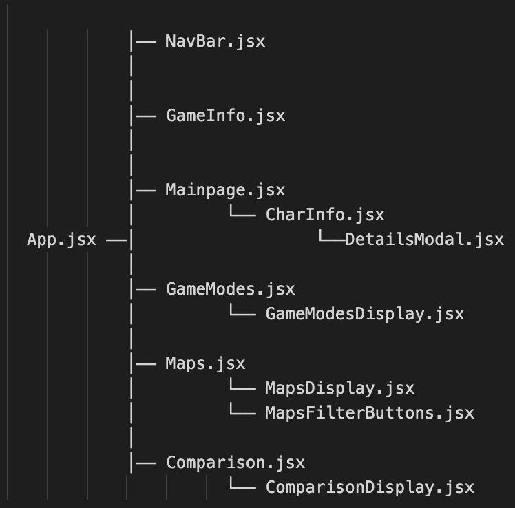
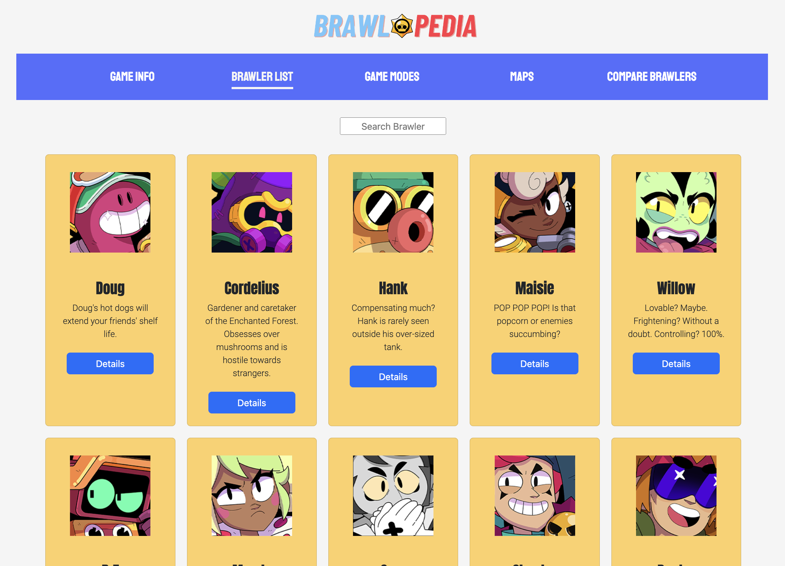
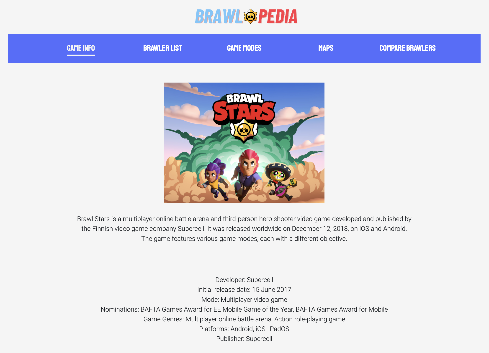
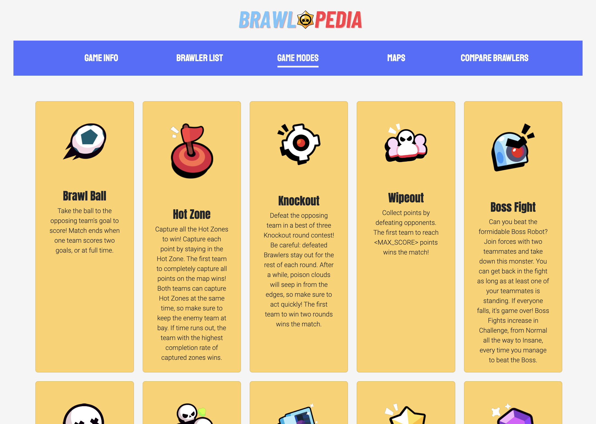
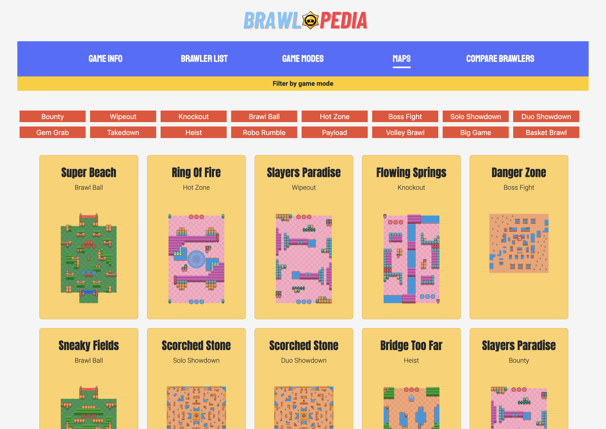
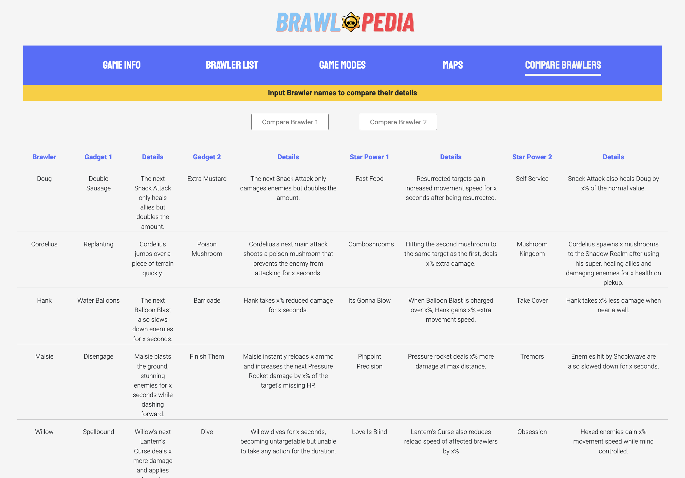

# Brawlopedia

A Brawl Stars Encyclopedia

## Brief description

Brawlopedia provides all-you-need-to-know information about the popular Brawl Stars game, developed by Supercell. Content includes the list of brawlers and specific details such as their type, gadgets and star powers, as well as game modes and maps. There is also a function where the details of 2 brawlers can be compared side by side.

## Technologies used

- React
- Javascript
- JSX
- CSS
- Bootstrap

## Website Wireframe

## Screenshots

### Game Info page

### Brawler List page with search function

### Game Modes page

### Maps page with filter buttons

### Compare Brawlers page with comparison search function

## Contact

[LinkedIn](https://www.linkedin.com/in/jolynn-khoo/)
